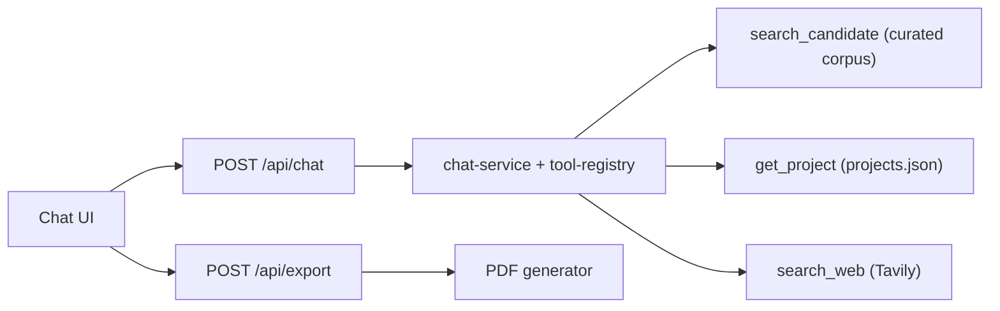

# Architecture

## Purpose
Deliver a demo-first assistant that is easy to review, run, and extend.

## Runtime Flow

## Boundaries
- `features/chat`: orchestration, system prompt, tool wiring.
- `features/retrieval`: embeddings adapter, ranking, snapshot access.
- `features/projects`: structured project catalog.
- `features/web-search`: Tavily client + normalized output.
- `features/export`: PDF generation from chat messages.

## Candidate Data Boundary
`search_candidate` uses only curated candidate sources through ingest whitelist.

Whitelisted files:
- `bio.md`
- `cv.md`
- `projects-highlights.md`
- `selected-stories.md`
- `selected-posts.md`

Enforcement:
- `scripts/candidate-sources.ts` (whitelist + required files)
- `scripts/ingest-corpus.ts` (builds `src/content/corpus.json`)

## Tool Contracts
- `search_candidate`: `{ query } -> { hits: [{ chunkId, source, sourceType?, excerpt, score }] }`
- `get_project`: `{ name } -> { name, role, cycleTime, handoff, description, links[] }`
- `search_web`: `{ query } -> { results: [{ title, url, snippet, score? }] }`

## Trade-offs
- Snapshot corpus is committed for reproducibility and simpler review.
- Curated corpus reduces narrative drift and keeps responses focused on the candidate.
- PDF export is intentionally minimal and interview-demo oriented.
