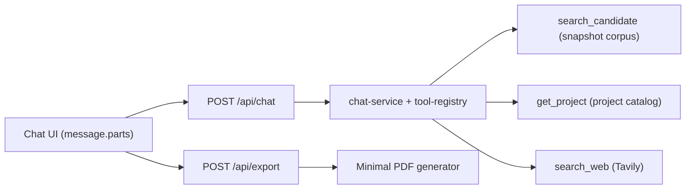

# Architecture

## Design Goal

Deliver a demo-first artifact that is easy to review, deploy, and evolve without overengineering.

## System Flow

## Module Boundaries

- `features/chat`: orchestration, prompt, tool wiring, message mapping, tool envelopes.
- `features/retrieval`: embedding provider contract, OpenAI adapter, ranking, snapshot access.
- `features/projects`: structured project catalog access.
- `features/web-search`: Tavily adapter + normalized search output.
- `features/export`: plain PDF generation for chat history.
- `shared/*`: cross-feature primitives only (`env`, `result`, `errors`, `observability`, `constants`).

## Tool Contracts

- `search_candidate`
  - Input: `{ query }`
  - Output: `{ ok: true, data: { hits: [{ chunkId, source, excerpt, score }] } }` or unified error envelope.
- `get_project`
  - Input: `{ name }`
  - Output: `{ ok: true, data: { name, role, cycleTime, handoff, description, links[] } }` or error envelope.
- `search_web`
  - Input: `{ query }`
  - Output: `{ ok: true, data: { results: [{ title, url, snippet, score? }] } }` or error envelope.

## Trade-offs

- Snapshot corpus is committed to repo for reproducibility and deployment simplicity.
- Retrieval uses compact vectors to keep ingestion and runtime lightweight for demo scope.
- PDF export is intentionally plain (roles + text + tool summaries) to satisfy mandatory capability with minimal complexity.

## Migration Seams

- Replace embeddings provider by changing `EmbeddingProvider` implementation.
- Replace web search by swapping `tavily-client.ts` and keeping normalized output contract.
- Replace corpus backend by changing `snapshot-corpus.ts` while preserving retrieval interface.
